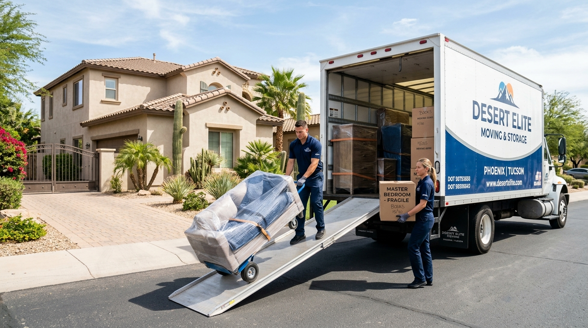
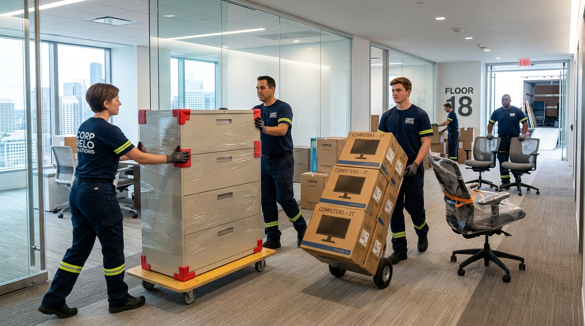
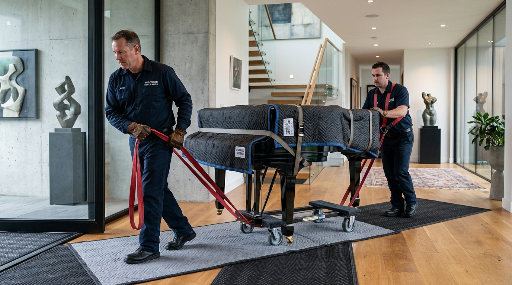

# 🚛 Edward Moll — Frontend Portal & Admin Management System

<div align="center">

[](https://react.dev/)
[](https://www.typescriptlang.org/)
[](https://vite.dev/)
[](https://tailwindcss.com/)
[](https://redux-toolkit.js.org/)
[](https://edwardmoll-frontend-nine.vercel.app)

<br/>

**Official Web Application & Administrative Dashboard for Edward Moll Moving & Relocation Services (AAAAAffordable Moving)**  
*Providing licensed, insured, flat-rate residential, commercial, senior, and realtor relocation solutions across Phoenix, Arizona & the Valley.*

[Explore Live Website](https://edwardmoll-frontend-nine.vercel.app) • [Access Admin Portal](https://edwardmoll-frontend-nine.vercel.app/admin/login) • [Backend API](https://edwardmoll526.onrender.com) • [Interactive API Docs](https://edwardmoll526.onrender.com/api)

</div>

---

## 📌 Repository Overview

| Property | Value |
|---|---|
| **Repository Name** | `edwardmoll-frontend` |
| **Project Name** | **Edward Moll Relocation Client & Admin Portal** |
| **Production URL** | [https://edwardmoll-frontend-nine.vercel.app](https://edwardmoll-frontend-nine.vercel.app) |
| **Backend REST API** | [https://edwardmoll526.onrender.com](https://edwardmoll526.onrender.com) |
| **Swagger Documentation** | [https://edwardmoll526.onrender.com/api](https://edwardmoll526.onrender.com/api) |
| **Target Service Area** | Phoenix, Scottsdale, Mesa, Chandler, Tempe, Glendale & Valley-wide (Arizona) |

---

## 📸 Fleet & Service Operations

The platform powers customer quotes, scheduling, and showcases comprehensive moving logistics:

<div align="center">
  
  <p><em>Modern fleet operations and on-site residential moving teams</em></p>
</div>

<div align="center">
  <table border="0">
    <tr>
      <td width="50%" align="center">
        
        <br/><b>White-Glove Packing & Furniture Protection</b>
      </td>
      <td width="50%" align="center">
        
        <br/><b>Corporate & Office Relocation Logistics</b>
      </td>
    </tr>
    <tr>
      <td width="50%" align="center">
        
        <br/><b>Specialty, Antique & Heavy Piano Moving</b>
      </td>
      <td width="50%" align="center">
        
        <br/><b>Client Satisfaction & Turnkey Move-In Care</b>
      </td>
    </tr>
  </table>
</div>

---

## 🌟 Key Features

### 🏢 Public Client Portal
- ⚡ **Instant Quote Gateway:** Get flat-rate moving estimates under 60 seconds with no spammy requirements.
- 🚚 **Comprehensive Moving Solutions:**
  - Residential Home & Apartment Relocation
  - Corporate Office Moving & IT Equipment Transport
  - Senior Downsizing & Gentle Transition Relocation
  - Packing, Unpacking, and Full Crating Support
  - Realtor Staging & Fast-Turnaround Property Transfers
- 🖼️ **Dynamic Gallery:** High-resolution visual showcase of real moving crews, equipment, and fleet.
- 📰 **Community & Updates Hub:** Interactive blog articles with nested comments, real-time likes, and social sharing.
- 🤝 **Realtor Partnership Program:** Dedicated workflows for Valley real estate agents and brokers.
- 📬 **Validated Inquiry Form:** Direct customer request portal with instant validation and email forwarding.
- 📱 **Fully Responsive UI:** Optimized for mobile phones, tablets, and high-DPI desktop screens.

### 🛡️ Secure Admin Management Center
- 🔐 **JWT Token Authentication:** Role-Based Access Control (`OWNER`, `ADMIN`) guarding protected management routes.
- 📊 **Real-time Operational Metrics:** Analytical dashboard tracking active services, posts, images, and new leads.
- 🛠️ **Service Catalog Management:** Create, reorder, update, and toggle active/inactive moving services.
- 📸 **Cloudinary Asset Manager:** Add, edit, and organize gallery photos with tags and sort priority.
- ✍️ **Blog & Article CMS:** Markdown-friendly post editor with SEO slugs, cover image uploads, and comment moderation.
- 📬 **Customer Inquiry Inbox:** View inbound customer quotes, mark inquiries as resolved/read, and organize follow-ups.

---

## 🛠️ Technology Stack

| Category | Technology | Version | Purpose |
|---|---|---|---|
| **Core Framework** | [React](https://react.dev/) | `19.2.8` | Next-generation declarative UI runtime |
| **Language** | [TypeScript](https://www.typescriptlang.org/) | `6.0.3` | End-to-end static typing and interface contracts |
| **Bundler & Tooling** | [Vite](https://vite.dev/) | `8.2.0` | Ultra-fast HMR and optimized production bundles |
| **Styling & Design** | [Tailwind CSS](https://tailwindcss.com/) | `4.3.3` | Utility-first styling engine |
| **UI Components** | [shadcn/ui](https://ui.shadcn.com/) / Radix UI | Latest | Accessible, headless primitives and components |
| **Client Routing** | [React Router DOM](https://reactrouter.com/) | `7.18.2` | Single-page application navigation & protected routes |
| **State Management** | [Redux Toolkit](https://redux-toolkit.js.org/) | `2.12.0` | Centralized state store & RTK Query / auth persistence |
| **Forms & Validation** | [React Hook Form](https://react-hook-form.com/) + [Zod](https://zod.dev/) | `7.84.0` / `4.4.3` | Type-safe form handling and schema validation |
| **Animations** | [Framer Motion](https://www.framer.com/motion/) | `13.1.0` | Fluid page transitions and interactive micro-animations |
| **Data Visualization** | [Recharts](https://recharts.org/) | `3.10.1` | Admin analytics dashboards and trend charts |
| **Notifications** | [Sonner](https://sonner.emilkowal.ski/) & [React Toastify](https://fkhadra.github.io/react-toastify/) | Latest | Non-blocking user feedback alerts |

---

## 📂 Architecture & Directory Structure

```
edwardmoll-frontend/
├── public/                     # Static icons, favicons, and manifests
├── src/
│   ├── assets/                 # Brand logos, local photography & SVG icons
│   │   └── images/             # Moving trucks, crews, packing, and fleet assets
│   ├── components/
│   │   ├── component/          # Domain-specific page sections
│   │   │   ├── about/          # About hero, cards, and CTA sections
│   │   │   ├── contact/        # Contact area, inquiry forms, and location maps
│   │   │   ├── Home/           # Hero section, why choose us, fleet ribbons, reviews
│   │   │   ├── realtors/       # Realtor partner program and perks
│   │   │   └── service/        # Moving service cards and catalog grid
│   │   ├── shared/             # Reusable global UI elements (wrappers, headers, buttons)
│   │   └── ui/                 # shadcn/ui headless UI components (dialogs, tables, cards)
│   ├── hooks/                  # Custom React hooks (e.g., use-mobile)
│   ├── layout/                 # Main header, navigation bar, and footer
│   ├── lib/                    # Utility helpers (cn, formatters)
│   ├── pages/                  # Route-level views
│   │   ├── Home.tsx            # Landing page
│   │   ├── About.tsx           # Company background & story
│   │   ├── ServicesPage.tsx    # Full catalog of moving services
│   │   ├── Gallery.tsx         # Media gallery with categories
│   │   ├── Updates.tsx         # Moving tips & company announcements
│   │   ├── PostDetail.tsx      # Single article view with comments
│   │   ├── Realtors.tsx        # Realtor VIP program
│   │   ├── Contact.tsx         # Contact & instant quote submission
│   │   ├── NotFound.tsx        # Custom 404 page
│   │   └── admin/              # Protected management pages
│   │       ├── AdminLogin.tsx  # Secure credential authentication
│   │       ├── Dashboard.tsx   # Admin operational overview
│   │       ├── ServicesManager.tsx # Service CRUD management
│   │       ├── GalleryManager.tsx  # Image and asset manager
│   │       ├── PostsManager.tsx    # Article publisher & manager
│   │       └── InquiriesManager.tsx# Lead & message inbox
│   ├── routes/
│   │   └── AppRoutes.tsx       # Route definitions & protected route guards
│   ├── store/                  # Redux slices and API query services
│   ├── App.tsx                 # Root application wrapper
│   └── main.tsx                # React DOM entry point
├── vercel.json                 # Vercel SPA routing rewrite rules
├── vite.config.ts              # Vite configuration & path aliasing
└── package.json                # Project dependencies and npm scripts
```

---

## 🚀 Getting Started

### Prerequisites
- **Node.js:** `>= 18.0.0` (LTS recommended)
- **Package Manager:** `npm` (v9+) or `yarn` / `pnpm`
- **Backend API:** An active instance of `edwardmoll-backend` (locally or on Render)

### 1. Clone the Repository
```bash
git clone https://github.com/Ramjanict/edwardmoll-frontend.git
cd edwardmoll-frontend
```

### 2. Install Dependencies
```bash
npm install
```

### 3. Environment Configuration
Create a `.env` file in the root directory:

```env
# Backend REST API endpoint (point to local backend or live deployment)
VITE_API_URL=https://edwardmoll526.onrender.com
# For local backend testing, use:
# VITE_API_URL=http://localhost:3000
```

### 4. Run Development Server
```bash
npm run dev
```
Open your browser at `http://localhost:5173`.

### 5. Production Build & Preview
```bash
# Build production bundle with TypeScript type-checking
npm run build

# Preview production build locally
npm run preview

# Run ESLint validation
npm run lint
```

---

## 🔐 Administrative Access

The management portal is accessible at:
👉 **[https://edwardmoll-frontend-nine.vercel.app/admin/login](https://edwardmoll-frontend-nine.vercel.app/admin/login)**

### Default Administrative Credentials
| Role | Email | Password |
|---|---|---|
| **System Administrator** | `admin@gmail.com` | `Admin@1234` |

> *Note: For security in production, always update the default admin password in the database upon initial deployment.*

---

## 🌐 Deployment on Vercel

The application is pre-configured for instant zero-configuration deployment on **Vercel**.

`vercel.json` provides single-page routing rewrites:
```json
{
  "rewrites": [{ "source": "/(.*)", "destination": "/" }]
}
```

### Deployment Instructions:
1. Connect your GitHub repository `Ramjanict/edwardmoll-frontend` to [Vercel](https://vercel.com).
2. Configure Environment Variable:
   - `VITE_API_URL`: `https://edwardmoll526.onrender.com`
3. Trigger deployment. Every push to the `main` branch automatically deploys to production.

---

## 🔗 Related Repositories

- ⚙️ **Backend Core API:** [Ramjanict/edwardmoll-backend](https://github.com/Ramjanict/edwardmoll-backend)
- 📖 **Interactive Swagger Docs:** [https://edwardmoll526.onrender.com/api](https://edwardmoll526.onrender.com/api)

---

## 📄 License & Attribution

Copyright © Edward Moll Moving & Relocation Services / AAAAffordable Moving.  
All rights reserved. Developed and maintained by [Ramjan](https://github.com/Ramjanict).
